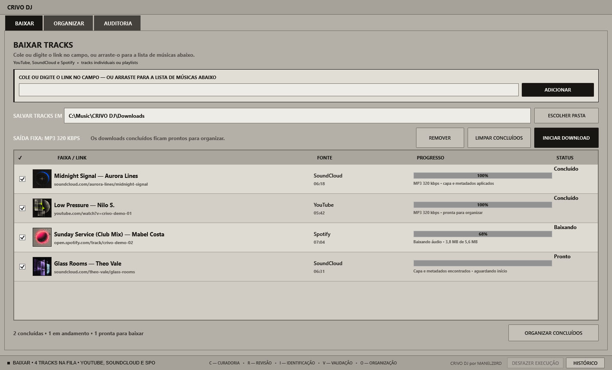
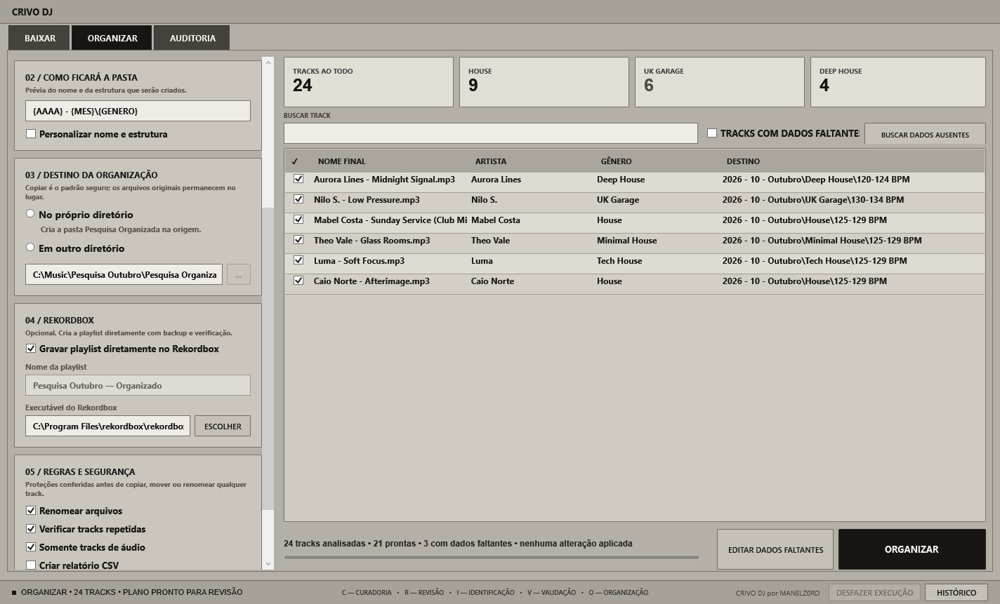
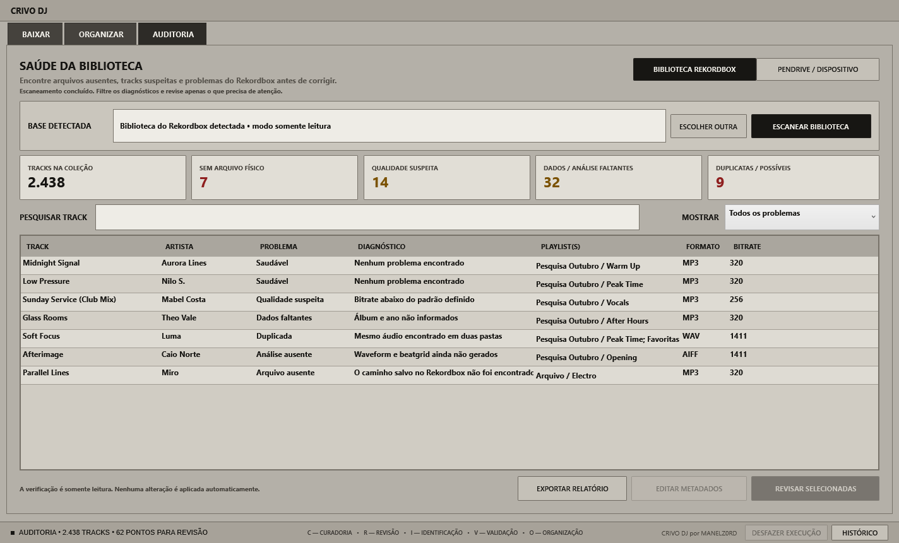

<p align="center">
  
</p>

<h1 align="center">CRIVO DJ</h1>

<p align="center"><strong>Curadoria, Revisão, Identificação, Validação e Organização</strong></p>

<p align="center">
  
  
  
  
  
</p>

<p align="center"><strong>CRIVO DJ por MANELZ0RD</strong></p>

Aplicativo portátil para Windows que conecta download de músicas, curadoria, organização e Rekordbox em um fluxo único. O CRIVO DJ pode cuidar de todo o caminho, do link até uma playlist pronta no Rekordbox. Também pode trabalhar separadamente com uma pasta de músicas que você já possui ou com a auditoria da sua biblioteca.

> **Beta fechado:** use sempre cópias ou backups durante os testes. A escrita direta no Rekordbox possui backup, transação e verificação, mas não substitui uma biblioteca bem protegida.

## Download

A versão portátil completa, com as dependências necessárias, é distribuída pela seção [**Releases**](https://github.com/manelz0rd2/CRIVO-DJ/releases). Baixe o ZIP da versão mais recente, extraia em uma pasta comum e abra `CRIVO DJ.exe`. Não é necessário instalar nem executar como administrador.

O repositório guarda o código-fonte, testes e documentação. Binários de terceiros e o pacote pronto ficam anexados à Release para manter o histórico Git leve e auditável.

## Visão geral

### Baixar



### Organizar



### Auditoria



## O que o CRIVO DJ faz

### Workflow completo: baixar → revisar → organizar → Rekordbox

O CRIVO DJ aceita tracks individuais e playlists do YouTube, SoundCloud e Spotify. Uma playlist é separada em tracks dentro da lista, com capa, título, artista, duração, origem e progresso independentes. Depois do download, as músicas seguem para a organização sem precisar remontar a seleção manualmente.

Na etapa de organização, o programa monta uma prévia da estrutura de pastas, identifica dados faltantes e permite corrigir manualmente título, artista, álbum, gênero, ano e outros campos antes de aplicar qualquer mudança. Ao concluir, os arquivos ficam organizados no computador e, opcionalmente, são registrados na coleção e em uma playlist do Rekordbox com o nome escolhido no CRIVO.

```text
track ou playlist → fila com capas → revisão de dados → organização física → playlist no Rekordbox
```

O arquivo de áudio permanece no destino organizado; o Rekordbox recebe a referência correta para a track. A integração direta cria backup do banco, usa transação e confere o resultado antes de encerrar.

### Somente organizar músicas existentes

O download não é obrigatório. Você pode apontar o CRIVO DJ para qualquer pasta que já contenha sua pesquisa musical, revisar como cada arquivo ficará, editar dados faltantes e organizar por data, gênero, BPM ou uma combinação desses critérios. O modo padrão copia os arquivos e preserva os originais; mover é uma escolha explícita. Essa organização também pode terminar em uma playlist criada diretamente no Rekordbox.

### Auditoria independente da biblioteca

A Auditoria funciona como uma ferramenta separada do fluxo de download e organização. Ela lê a biblioteca do Rekordbox em modo somente leitura durante o escaneamento e ajuda a localizar:

- tracks sem arquivo físico, com caminho inacessível ou fora da coleção;
- metadados incompletos e possíveis problemas de qualidade;
- tracks sem dados de análise do Rekordbox;
- duplicatas exatas ou prováveis;
- arquivos órfãos e inconsistências entre o banco, as pastas e um pendrive exportado;
- as playlists e pastas de playlists das quais cada track faz parte.

Os resultados podem ser pesquisados, filtrados e exportados. O escaneamento não corrige nada automaticamente: a revisão e qualquer gravação posterior são decisões explícitas do usuário.

### Onde entra o Rekordbox

O CRIVO DJ prepara, organiza, registra playlists e audita a biblioteca. O Rekordbox continua responsável pela análise musical definitiva, incluindo waveform, beatgrid, BPM e tonalidade, além da exportação final para pendrives e equipamentos.

## Recursos

- baixa tracks individuais ou playlists do YouTube, SoundCloud e Spotify;
- separa playlists em tracks e mostra capa, artista, duração e progresso de cada música;
- organiza MP3, WAV, FLAC, AIFF, M4A e outros formatos em pastas por data, gênero e BPM;
- mostra uma prévia completa antes de copiar, mover ou renomear qualquer arquivo;
- encontra dados faltantes e permite editar título, artista, álbum, gênero e ano antes da organização;
- busca sugestões de dados online, sempre deixando a aprovação com o usuário;
- identifica tracks repetidas e permite escolher o que fazer quando encontra arquivos com o mesmo nome ou conteúdo;
- cria ou atualiza uma playlist diretamente no Rekordbox com as músicas organizadas;
- audita a biblioteca do Rekordbox e pendrives para encontrar arquivos ausentes, qualidade suspeita, dados incompletos, análises ausentes e duplicatas;
- mostra em quais playlists do Rekordbox cada track aparece;
- exporta relatórios, mantém histórico e permite desfazer organizações preservadas;
- funciona de forma portátil no Windows, sem instalação e sem exigir permissão de administrador.

## Recursos técnicos

- interface WPF executada pelo Windows PowerShell 5.1, com launcher próprio em C# e funcionamento portátil;
- leitura e gravação de tags com TagLibSharp para MP3, WAV, FLAC, AIFF/AIF, M4A, AAC, OGG e WMA;
- fila de download baseada em yt-dlp, FFmpeg e spotDL, com expansão de playlists, resolução assíncrona de metadata e limite de transferências simultâneas;
- enriquecimento de metadata pelo MusicBrainz e identificação opcional por fingerprint AcoustID, com cache local, pontuação de confiança e aprovação antes da escrita;
- motor de organização com simulação prévia, templates de destino, tratamento de conflitos e manifesto reversível para desfazer execuções;
- detecção de duplicatas por nome, tamanho, metadata semelhante e hash SHA-256;
- inspeção de qualidade por codec, bitrate, sample rate, bit depth e amostragem de frames MP3 para diferenciar CBR e VBR;
- integração com o `master.db` do Rekordbox por Pyrekordbox e SQLCipher, com backup datado, transação, reabertura e verificação do resultado;
- leitura de playlists, associações entre tracks e pastas, arquivos ANLZ e diagnósticos de waveform e beatgrid;
- XML e M3U8 mantidos como formatos auxiliares de interoperabilidade e recuperação;
- relatórios em CSV e JSON, logs em modo simples ou detalhado e exportação de diagnóstico sanitizado;
- testes automatizados de regressão, interface, stress, auditoria em runtime e escrita do Rekordbox em banco sandbox.

## Do link até o Rekordbox

O fluxo principal do CRIVO DJ começa com um link e termina com as tracks organizadas no computador e reunidas em uma playlist do Rekordbox.

Cole uma track ou playlist do YouTube, SoundCloud ou Spotify no campo. Se preferir, simplesmente arraste o link para a lista. Quando recebe uma playlist, o CRIVO separa o conteúdo em tracks e apresenta cada música com sua própria capa, título, artista, duração e progresso. Nada é baixado antes da sua confirmação.

Depois do download, **Organizar concluídos** leva as músicas diretamente para a próxima etapa. Ali você escolhe como as pastas ficarão, confere os nomes finais e pode corrigir dados faltantes antes de aplicar qualquer mudança. O padrão seguro copia os arquivos e mantém os originais preservados.

Se a opção **Gravar playlist diretamente no Rekordbox** estiver marcada, o CRIVO cria ou atualiza a playlist escolhida e registra nela as tracks organizadas. Antes de escrever, o programa exige que o Rekordbox esteja fechado, cria um backup e verifica o resultado. Os arquivos de áudio continuam na pasta organizada; o Rekordbox recebe a referência correta para cada um.

O Rekordbox continua responsável pela análise final de waveform, beatgrid, BPM e tonalidade, além da exportação para pendrives e equipamentos.

> No Spotify, o CRIVO usa os dados da track para localizar uma fonte externa compatível; ele não extrai o áudio do streaming. Baixe apenas conteúdos que você tenha autorização para usar.

## Buscar dados ausentes

Depois de analisar uma pasta, clique em **Buscar dados ausentes**. O CRIVO DJ consulta somente as faixas selecionadas que tenham título, artista, álbum, gênero ou ano ausentes. Os resultados aparecem em uma comparação entre **Dados atuais** e **Encontrado online**, com confiança e fonte. Nada é aplicado sem aprovação, e o arquivo só é alterado quando a gravação de tags for escolhida.

A busca textual no MusicBrainz funciona sem conta. Para identificação pelo áudio, registre uma chave de cliente em https://acoustid.org/api-key e cole-a em **Regras e formatos → Chave de cliente AcoustID**. A impressão digital é calculada localmente; o áudio não é enviado.

Na revisão, a opção **Gravar tags aprovadas nos arquivos** escreve os campos usando TagLibSharp e registra os valores anteriores no histórico. Essa execução pode ser escolhida em **Desfazer execução**.

## Variáveis de pasta

`{AAAA}`, `{AA}`, `{MES}`, `{MES_NUM}`, `{DIA}`, `{GENERO}`, `{ARTISTA}`, `{ALBUM}`, `{ANO}`, `{BPM}`, `{BPM_RANGE}`, `{KEY}`, `{EXTENSAO}`, `{FORMATO}`, `{PASTA_ORIGEM}`, `{PASTA_PAI}`, `{PASTA_RAIZ}`, `{NOME_ARQUIVO}`, `{TITULO}`, `{BITRATE}` e `{SAMPLE_RATE}`.

Exemplo: `{AAAA} - {MES_NUM} - {MES} - {GENERO} - {BPM_RANGE}`.

## Segurança

- Calcular e exportar a simulação não altera nenhum arquivo.
- O plano inteiro é validado antes da execução.
- `Copiar` é o padrão.
- Cada execução pode gerar um manifesto para desfazer.
- Pastas de saída e pastas excluídas não retornam ao scanner.
- O modo **Mover** exige confirmação explícita.

## Leitura e gravação de metadata

O CRIVO DJ inclui o TagLibSharp para ler e gravar tags nos formatos compatíveis. Quando uma tag é alterada pela revisão online, os valores anteriores são registrados no histórico para permitir o desfazer.

## Testes

```powershell
powershell.exe -NoProfile -ExecutionPolicy Bypass -File .\Tests\RunTests.ps1
powershell.exe -NoProfile -ExecutionPolicy Bypass -File .\Tests\TestRekordboxSandbox.ps1
powershell.exe -NoProfile -ExecutionPolicy Bypass -STA -File .\Tests\TestAuditRuntime.ps1
```

O segundo teste escreve apenas numa cópia temporária do `master.db`, confere a playlist, repete a importação para detectar duplicação e verifica por hash que o banco real permaneceu intacto. O terceiro percorre exatamente a rotina do botão **Analisar agora** em modo somente leitura e confirma os indicadores e a lista de tracks.

## Estrutura do projeto

```text
Assets/       identidade visual e ícones
Config/       configuração padrão sanitizada
Modules/      scanner, metadata, downloads, organização e Rekordbox
Tests/        regressão, stress, runtime e sandbox
Tools/        fontes dos launchers e da integração direta
UI/           interface WPF
ODT.ps1       aplicação principal
```

Consulte também o [histórico de versões](CHANGELOG.md), as [orientações para contribuir](CONTRIBUTING.md), a [política de segurança](SECURITY.md) e as [dependências de terceiros](THIRD-PARTY.md).

## Licença

Este repositório ainda não possui uma licença pública de reutilização. Todos os direitos permanecem reservados a MANELZ0RD até a definição da licença do projeto. As dependências mantêm suas próprias licenças, listadas em `THIRD-PARTY.md`.
